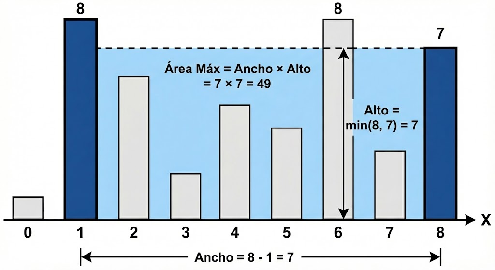

# Examen práctico - Evaluación Continua 2025-26
## Fundamentos de Programación 1. Grado en Ingeniería Informática – Inteligencia Artificial (Universidad de Sevilla)

## Instrucciones

1. Completa tu **nombre y apellidos** en el fichero `identificacion.txt`.
2. Activa la opción **Autoguardado (Auto Save)** en el menú Archivo (File).
3. Realiza cada ejercicio número XX en el módulo `src/ejercicioXX.py`. **No toques los prototipos de las funciones ni los comentarios de documentación**.
4. Asegúrate de comprobar que tu implementación pasa todos los tests. Para ejecutar los tests del ejercicio número XX, descomenta la línea `#test_ejercicioXX()` que encontrarás al final del módulo `src/tests.py`. 
5. Si algún test falla, **utiliza el depurador para tratar de solucionarlo**. 
6. Puedes ejecutar el módulo `src/calcula_nota.py` para obtener una estimación de tu nota. Ten en cuenta que se trata de una nota aproximada, ya que:
   * La nota de un ejercicio puede ser más baja, si la implementación comete errores no detectados por los tests automáticos.
   * La nota de un ejercicio puede ser más alta, si se han cometido errores menores que han impedido pasar algunos tests automáticos.

## Ejercicios

### Ejercicio 1 (1,25 puntos)

Implementa la función `convierte_binario_a_decimal`, que recibe un número binario representado como una cadena de texto (**binario**) y devuelve su representación en sistema decimal (número entero).

Por ejemplo, si **binario** es `"1010"`, el resultado devuelto será `10`.

Un posible algoritmo para resolverlo sería el siguiente:
* Inicializa una variable **resultado** con un 0.
* Recorre los caracteres (bits) del número en binario de **derecha a izquierda**.
    * Si el bit actual es un 1, suma al **resultado** 2 elevado a la posición actual (la posición es 0 para el primer bit empezando por la derecha, 1 para el siguiente, etc...).
    * Si el bit actual es un 0, no se hace nada.

### Ejercicio 2 (1,25 puntos)

Implementa la función `divide_cadena`, que recibe un **texto** y lo divide en dos nuevas cadenas. La función debe devolver una tupla conteniendo:
1. Una cadena formada por los caracteres que se encuentran en las posiciones pares (0, 2, 4...).
2. Una cadena formada por los caracteres que se encuentran en las posiciones impares (1, 3, 5...).

Por ejemplo, si el **texto** es `"abcdefghij"`, el resultado devuelto será `("acegi", "bdfhj")`.

### Ejercicio 3 (1,25 puntos)

Implementa la función `mayor_area`, que recibe una lista de enteros **alturas** representando paredes verticales en un plano. Debes encontrar la mayor área de agua que se puede formar eligiendo dos paredes y usando el eje X como base. Ten en cuenta que el área está limitada por la altura de la pared más baja de las dos escogidas.




Por ejemplo, para las **alturas** `[1, 8, 6, 2, 5, 4, 8, 3, 7]`, la mayor área es `49`, formada entre las paredes en las posiciones 1 (altura 8) y 8 (altura 7). El cálculo sería `min(8, 7) * (8 - 1) = 7 * 7 = 49`.

Puedes seguir el siguiente algoritmo:
1. Inicializa dos variables para apuntar a la **primera** y **última** posición de la lista.
2. Calcula el área de agua que contendrían las paredes apuntadas por **primera** y **última**:
    * Si el área es la mayor obtenida hasta el momento, guárdala. 
    * Si la pared apuntada por **primera** es menor que la pared apuntada por **última**, incrementamos la posición **primera**.
    * Si no, decrementamos la posición **ultima**.
3. Repetimos el paso 2 mientras las posiciones **primera** y **última** no se crucen.

### Ejercicio 4 (1,25 puntos)

Implementa la función `calcula_racha_maxima`, que dada una lista de **fechas**, calcula la racha máxima de días consecutivos que aparecen en la lista.
    
Es importante tener en cuenta que:
1. Las fechas pueden venir desordenadas.
2. La lista puede contener fechas duplicadas (que no deben afectar al cálculo de la racha).
3. Si la lista está vacía, debe devolver 0.
4. No se debe modificar la lista de fechas recibida.

Por ejemplo, para las fechas `[2023-01-02, 2023-01-01, 2023-01-04, 2023-01-05, 2023-01-06, 2023-01-04]`, la racha máxima es `3` (correspondiente a los días 4, 5 y 6 de enero).

Puedes seguir este algoritmo:
* Prepara los datos eliminando duplicados y asegurando que las fechas estén en orden cronológico.
* Recorre la colección comparando cada fecha con la siguiente:
  * Si son días consecutivos, la racha actual aumenta.
  * Si hay un salto en el calendario, la racha se rompe y debe reiniciarse.
* Mantén un registro del valor de la racha más larga encontrada durante todo el proceso y devuélvelo al finalizar.

### Ejercicio 5 (1,25 puntos)

Implementa la función `es_matriz_identidad`, que recibe una matriz (lista de listas de enteros) y comprueba si es la matriz identidad.

Una matriz identidad debe cumplir tres condiciones:
1. Debe ser una matria cuadrada (mismas filas y columnas).
2. Todos los elementos de la diagonal principal deben ser 1.
3. El resto de elementos deben ser 0.

Se considera que una matriz vacía **no es** una matriz identidad.

Por ejemplo, la siguiente matriz devolvería `True`:
```python
[
    [1, 0, 0],
    [0, 1, 0],
    [0, 0, 1]
]
```

### Ejercicio 6 (1,25 puntos)

Implementa la función `actualiza_stock`, que gestiona el inventario de una tienda tras una serie de ventas. 

La función recibe:
* **ventas**: Una lista de tuplas, donde cada tupla contiene `(nombre_producto, cantidad_vendida)`.
* **stock**: Un diccionario donde la clave es el nombre del producto y el valor es la cantidad disponible.

La función debe hacer dos cosas:
1. **Modificar el diccionario `stock`** restando las cantidades vendidas. Si se intenta vender más de lo que hay, el stock se queda en 0 y se vende solo lo disponible.
2. **Devolver una lista de tuplas** con los productos y las cantidades que **no** se pudieron vender por falta de stock.

Por ejemplo, con el stock `{"Manzana": 4, "Pan": 5, "Leche": 1}` y las ventas `[("Manzana", 5), ("Pan", 3), ("Leche", 2)]`:
* El stock pasará a ser: `{"Manzana": 0, "Pan": 2, "Leche": 0}`.
* La función devolverá: `[("Manzana", 1), ("Leche", 1)]`.

---
---
### Tupla nombrada `Producto`

En los siguientes ejercicios se utilizará la siguiente `namedtuple`, que representa un producto de una tienda:

```python
Producto = namedtuple('Producto', [
    'nombre',       # tipo str
    'categoria',    # tipo str
    'precio',       # tipo float
    'fecha_compra'  # tipo date
])
```

### Ejercicio 7 (1,25 puntos)

Implementa la función `calcula_precio_total_ultimos_dias`. Esta función recibe una lista de **productos**, un número entero de **dias** y una **fecha_actual**.

El objetivo es calcular la suma de los precios de todos los productos que hayan sido comprados dentro del rango de los últimos **dias** contados hacia atrás desde la **fecha_actual** (incluyendo el propio día límite).

Por ejemplo, si **dias** es 7, se deben sumar los precios de los productos cuya `fecha_compra` sea mayor o igual a hace 7 días desde la **fecha_actual**.

### Ejercicio 8 (1,25 puntos)

Implementa la función `categoria_mayor_gasto`, que determina cuál es la categoría en la que se ha gastado más dinero en total.

La función recibe una lista de **productos** y debe devolver una tupla `(nombre_categoria, gasto_total)`. Si existen varias categorías con el mismo gasto máximo, puedes devolver cualquiera de ellas. Si la lista de productos está vacía, debe devolver `None`.